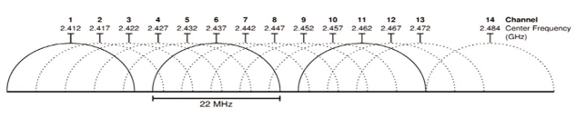

# Bezdrátové sítě (pásma, standardy, BSS, SSID, WPS, zabezpečení)
**Bezdrátová síť**

propojení zařízení za účelem komunikace bez přítomnosti fyzického vedení od zdroje k přijímači a naopak

**Bezdrátová síť ≠ WiFi**

Bezdrátové sítě se řadí IrDA, bluetooth, aj.

**WiFi není nic jiného než obchodní značka.**

Co vedlo k rozšíření WiFi - došlo k uvolnění dvou pásem **2.4GHz a 5GHz**

Standardy
- **IEEE802.11a**
  - rok 1999, 2.4GHz, přenosové rychlosti 11Mb/s, modulační mechanismus DSSS
- **IEEE802.11b**
  - rok 1999, 5GHz, přenosová rychlost 54Mb/s, OFDM
- **IEEE802.11g**
  - rok 2003, 2.4GHz, přenosová rychlost 54Mb/s, OFDM
- **IEEE802.11n**
  - rok 2009, 2.4/5GHz, přenosová rychlost až 600Mb/s, MIMO
- **IEEE802.11ac**
  - rok 2014, 5GHz, přenosová rychlost až 7Gb/s (8 antén, sdílené kanály, MU-MIMO)
- **IEEE802.11ax**
  - rok 2019, 2.4/5/6GHz, přenosová rychlost 10Gb/s
- **IEEE802.11ah**(900MHz), **IEEE802.11p**(5.9GHz), **IEEE802.11ad**(60GHz)

**Kanály:**
Na frekvenci 2.4GHz

Na frekvenci 5GHz

**DFS** *(dynamic frequency selection)* - automatický výběr kanálu v závislosti na území

**TPC** *(transmit power control)* - automatická korekce síly signálu v závislosti na území

Typy sítí:
- ad-hoc síť (bez AP)
- infrastrukturní mod (s AP)
- WDS link (repeatery)
- WDS bridge (wifi spoje)

AP (access point - přístupový bod)
- (wifi router v módu AP) veškerá komunikace vede přes něj.

BSS/IBSS (independent) basic service set
- je označení pro služby v rámci jednoho AP, defakto definuje rozsah jedné wifi sítě.

DS (distribuční systém)
- jedná se o systém jakým je AP připojen k okolní síti

ESS (extender service set)

- jedná se označení služeb v rámci několika AP, které spolu kooperují

SSID (service set ID)

- jméno sítě (max. 32 znaků)
- přenáší se nešifrovaně
- vysíláno pomocí beacon frame
- pro ESS musí být stejné

BSSID (basic service set ID)

- velikost 6Bajtů
- uživateli skryté
- jedinečné pro každý BSS
- BSSID v síti s AP je MAC adresa AP
- BSSID v ad-hoc je generováno náhodné

Autentizace a ochrana sítě

- žádná
- hide SSID
- rezervace MAC
- WEB (velmi jednoduše prolomitelné)
- PSK (prolomitelné)
- WPS tlačítko (prolomitelné)
- WPA klíč (prolomitelné)
- WPA2 (těžší na prolomení, ale lze)
- 802.1x (zatím neprolomené)

#### Základní otázky pro nasazení WiFi:

1. Jak velký prostor budeme pokrývat (kam, kolik)
1. Kolik zařízení cca bude mít za úkol připojovat do sítě (počet AP, počet antén)

**Bezdrátová síť** může být vybudována různými způsoby v závislosti na požadované funkci. Ve všech případech hraje klíčovou roli identifikátor **SSID** (Service Set Identifier), což je **řetězec až 32 ASCII znaků**, kterými se jednotlivé sítě rozlišují. SSID identifikátor je v pravidelných intervalech vysílán jako broadcast, takže všichni potenciální klienti si mohou snadno zobrazit dostupné bezdrátové sítě, ke kterým je možné se připojit

Aby mezi sebou mohla komunikovat zařízení různých výrobců i různých platforem, existují mezinárodní **standardy**. Jejich specifikací se zabývá institut IEEE, tyto standardy jsou publikovány pod číslem 802.11, většinou tyto **standardy definují** sítě pracující ve volném **pásmu 2,4 GHz, 5GHz**

**WPS (Wi-Fi Protected Setup)** je označení pro standard v počítačových sítích, který umožňuje snadno zabezpečit domácí bezdrátovou síť Wi-Fi, bohužel v roce 2011 se našla chyba kde může útočník získat WPS klíč a pomocí něho obnovit WPA/WPA klíč k wifi. Proto je v dnešní době nejpoužívanější standarda WPA2

#### Zabezpečení Wi-fi

Zabezpečit wi-fi lze pomocí Skrytí SSID, (identifikátor bezdrátové sítě), což je nejjednodušší zabezpečení ale je neefektivní. Protože vysílání SSID se dá stále odposlechnout protože se přenáší v otevřené formě.

Wifi lze jednoduše zabezpečit kombinací WPA2, to znamená že je povolen přístup jen určitým MAC adresám pomocí filtru. Bohužel i MAC adresa se dá odposlechnout a útočník si jí může naklonovat na svojí síťovou kartu a vydávat se tak za jakéhokoliv klienta.

WPA neboli Wi-Fi Protected Access, tj. chráněný přístup (šifrovací algoritmus) k Wi-Fi WPA a WPA2 jsou bezpečnostní protokoly, které řeší problémy WEP. Pokud je použito slabé heslo, jako slovníková fráze, nebo kratší řetězec, může být WPA a WPA2(IEEE 802.11i) prolomeno. Při použití dostatečně dlouhých hesel (např. 14 náhodných písmen) nebo passphrase (např. 5 náhodně zvolených slov) je předsdílená fráze (PSK – pre-shared key) je tím pádem neprolomitelná.
